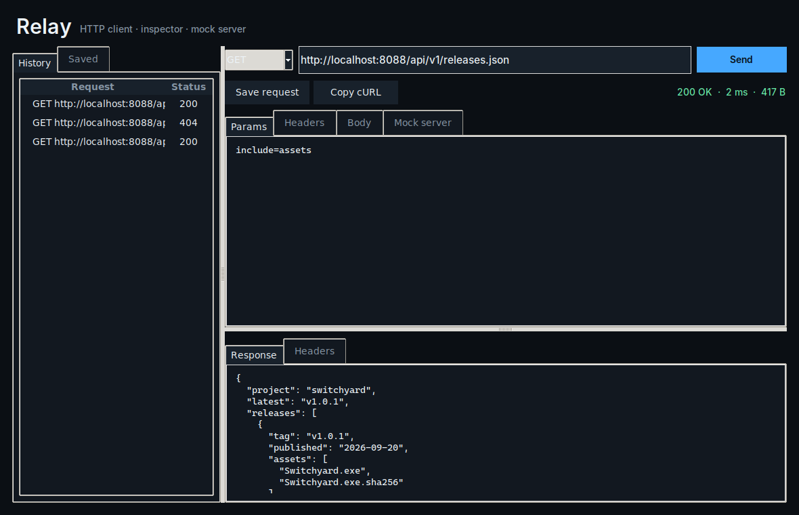

<div align="center">
  
  <h1>Relay</h1>
  <p><strong>A local-first HTTP client, request inspector, history browser, cURL exporter, and lightweight mock server.</strong></p>
  <p>
    <a href="https://github.com/purysho/Relay/actions/workflows/ci.yml"></a>
    <a href="https://github.com/purysho/Relay/releases"></a>
    <a href="LICENSE"></a>
    <a href="#download"></a>
  </p>
  <p><strong>Download:</strong> <a href="https://github.com/purysho/Relay/releases/latest/download/Relay-Windows-x64.exe">Windows</a> · <a href="https://github.com/purysho/Relay/releases/latest/download/Relay-macOS-arm64.zip">macOS</a> · <a href="https://github.com/purysho/Relay/releases/latest/download/Relay-Linux-x86_64.tar.gz">Linux</a> · <a href="#run-from-source">Run from source</a> · <a href="https://github.com/purysho/Relay/issues">Report an issue</a></p>
</div>



## What it does

- GET, POST, PUT, PATCH, DELETE, HEAD, and OPTIONS
- Query parameters, headers, and request bodies
- Formatted response body, headers, status, and timing
- Local request history and saved requests
- cURL export
- Built-in localhost mock endpoint

## Download

| Platform | File |
|---|---|
| Windows 10/11 (x64) | [Relay-Windows-x64.exe](https://github.com/purysho/Relay/releases/latest/download/Relay-Windows-x64.exe) — portable, no installer |
| macOS (Apple Silicon) | [Relay-macOS-arm64.zip](https://github.com/purysho/Relay/releases/latest/download/Relay-macOS-arm64.zip) — unzip and move to Applications |
| Linux (x86_64) | [Relay-Linux-x86_64.tar.gz](https://github.com/purysho/Relay/releases/latest/download/Relay-Linux-x86_64.tar.gz) — extract and run `./Relay` |

Each [release](https://github.com/purysho/Relay/releases) is built from the tagged source by GitHub Actions and carries a `SHA256SUMS.txt`. The builds are not yet code-signed, so on first launch Windows SmartScreen may ask you to confirm ("More info" → "Run anyway"), and macOS may need you to Control-click the app and choose **Open**.

**Status: beta.** Relay does what this README describes and is covered by CI on Windows, macOS and Linux, but it is young: expect rough edges, and please [report them](https://github.com/purysho/Relay/issues).

## Run from source

Requirements: Python 3.10+ with Tk support.

```powershell
pyw relay_desktop.pyw
```

The application uses Python's standard library at runtime.

## Build a standalone Windows executable

```powershell
powershell -ExecutionPolicy Bypass -File .\build-windows.ps1
```

Output:

```text
dist\Relay.exe
```

## Privacy

History and saved requests stay in ~/.relay/. Relay only sends traffic to endpoints the user explicitly requests; its mock server binds to 127.0.0.1 by default.

## Scope

Relay intentionally focuses on fast manual HTTP work and local mocking rather than hosted team workspaces or cloud collaboration.

## Release process

- Every push runs tests/compile checks and builds a Windows executable artifact.
- Tags matching `v*` build the executable again, compute SHA256, and publish both files to GitHub Releases.
- See [CHANGELOG.md](CHANGELOG.md) for release history.

## License

MIT
