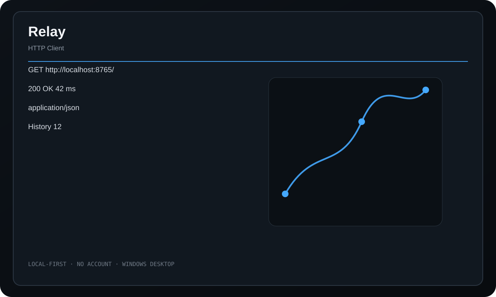

<div align="center">
  
  <h1>Relay</h1>
  <p><strong>A local-first HTTP client, request inspector, history browser, cURL exporter, and lightweight mock server.</strong></p>
  <p>
    <a href="https://github.com/purysho/Relay/actions/workflows/ci.yml"></a>
    <a href="https://github.com/purysho/Relay/releases"></a>
    <a href="LICENSE"></a>
  </p>
  <p><a href="https://github.com/purysho/Relay/releases"><strong>Download for Windows</strong></a> · <a href="#run-from-source">Run from source</a> · <a href="https://github.com/purysho/Relay/issues">Report an issue</a></p>
</div>



## What it does

- GET, POST, PUT, PATCH, DELETE, HEAD, and OPTIONS
- Query parameters, headers, and request bodies
- Formatted response body, headers, status, and timing
- Local request history and saved requests
- cURL export
- Built-in localhost mock endpoint

## Download

Tagged releases are built on `windows-latest` by GitHub Actions. Each release contains `Relay.exe` and `Relay.exe.sha256`. The executable is produced from the source at that tag with PyInstaller.

> Until the first tagged release is published, the latest Windows build is available as the **Relay-windows** artifact on successful CI runs.

## Run from source

Requirements: Python 3.10+ with Tk support.

```powershell
pyw relay_desktop.pyw
```

The application uses Python's standard library at runtime.

## Build a standalone Windows executable

```powershell
powershell -ExecutionPolicy Bypass -File .\build-windows.ps1
```

Output:

```text
dist\Relay.exe
```

## Privacy

History and saved requests stay in ~/.relay/. Relay only sends traffic to endpoints the user explicitly requests; its mock server binds to 127.0.0.1 by default.

## Scope

Relay intentionally focuses on fast manual HTTP work and local mocking rather than hosted team workspaces or cloud collaboration.

## Release process

- Every push runs tests/compile checks and builds a Windows executable artifact.
- Tags matching `v*` build the executable again, compute SHA256, and publish both files to GitHub Releases.
- See [CHANGELOG.md](CHANGELOG.md) for release history.

## License

MIT
